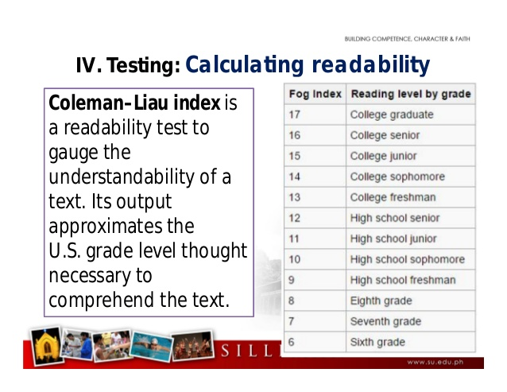
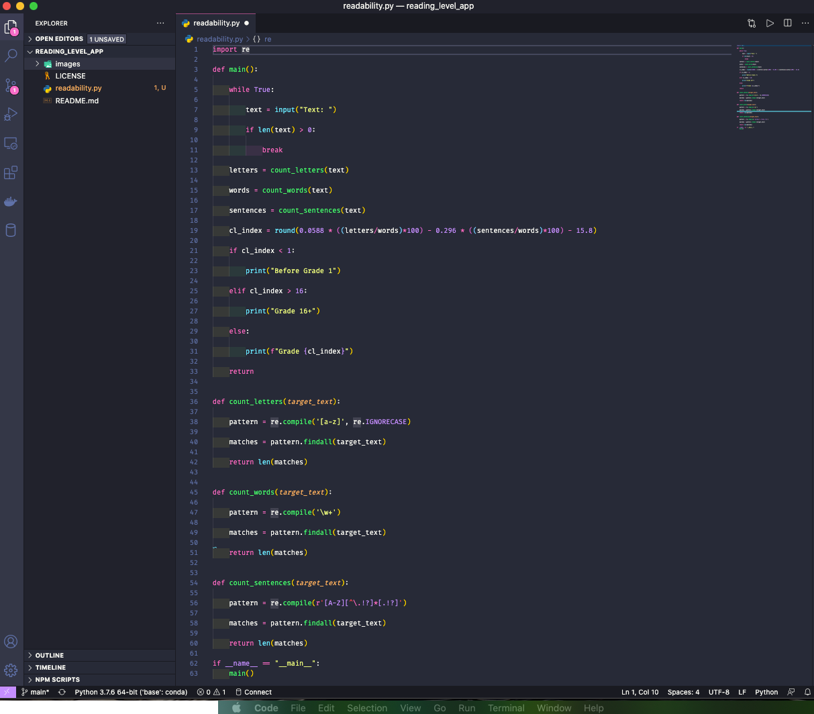

# Scholastic Reading Level Grade Detector With Python & RegEx

## Scope & Purpose | Main Built-in Functionalities

* Program that computes the approximate reading grade level of a inputted text using Python, Regular Expressions, and the Coleman Liau Index.

## System Prerequisites To Get Started

You will need the following installed on your computer system and import the following libraries:
* Python 3.7+
* Regular Expressions

## Getting Started

* Download the repository
* Run in the terminal

## Code Review - Recruiters / Hiring Managers

* Please view the readability.py file

## Code Review:

## Output Examples - Before And With Filters

### Personal Note

* Hope you enjoyed it. Thank you for your time!

## Author

* **Johneson Giang** - *Invidual Project* - [Github](https://github.com/jhustles)

## License

This project is licensed under the MIT License - see the [LICENSE.md](LICENSE.md) file for details

## Acknowledgments & Credits

* Shout out to David J. Mahlan & Brian Yu

